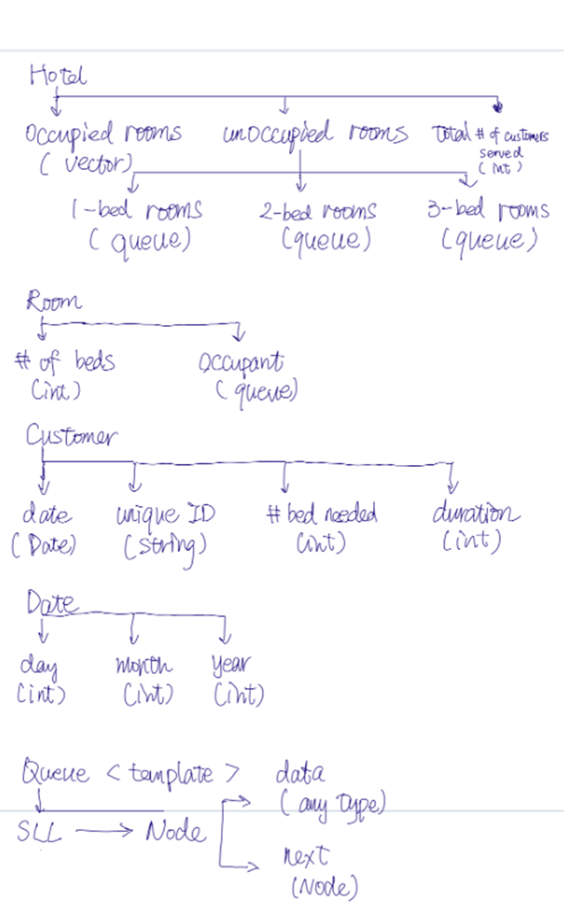

**Author**:		Jia Jun Liu  
**Date**:   			2021-05-18  
**Version**:			1.0  
**Project ID**: 		Assignment 1 - Hotel Manager Simulator  
**CS Class**:		    CPSC 2150   
**Programming Language**:	C++  
**Problem Description**：	This program simulates a hotel that can optimize the arrangement for random customers requesting rooms and report the result. Slot as many as customers into the hotel.

**Program Assumptions and Restrictions**：  
1) If your best available room has more beds than what customer asked for, you should assign that room to the customer. But switching the room when it’s assigned is not allowed. 
2) If the number of beds requested by customer is more than the biggest number of beds in all rooms, the program must accommodate the customer with more than one room.
3) To simplify the program, consider that the records in the file are issued in the same day as check-in date (ie. for each record check-in is today).  

**Limitation and known bugs**:  
The algorithm for arranging beds limit for 1 to 3 beds which is requested by each customer.  (Based on the data provided by customers.txt)

**Implementation Details**: (see page 2 for data structure)

**Additional Files**: customers.txt

**Performance Evaluation**: (see page 3 for time complexity of different functions in my classes)

**References**: asgn1-Lists.pdf, textbook

**Answer for Question B and C from asgn1_Lists**: (see page 3 and last page)

**Data structure**:  

 

**Highlight**:   
* Using vector for occupied rooms allow easy access for reading the data store in each occupied room.
* Using Queue for unoccupied rooms allow flexibility for expanding the hotel in the future and easy to adjust the number of rooms in the hotel.
* Store a queue in Class Room ease the repeating overwriting data store in a room. All occupants information can be retrieved through function front() implemented in Class Queue. When the room is empty, it will not need extra memory for storing a placeholder customer. 

**Time complexity of different functions in each Class**: 
(All getter and setter will be O(1) unless specify)  
I.	Class Hotel  
void add1BedR(int); O(n)   
void add2BedR(int); O(n)   
void add3BedR(int); O(n)   
void addNumServed(int num); O(1)  

II.	Class Room  
bool isEmpty(); O(1)   
void checkIn(Customer &); O(1)   
void checkOut(); O(1)  

III.	Class Customer
(Only getter and setter have been used)  
IV.	Class Date  
bool isLeapYear() const; O(1)  
bool operator==(Date) const; O(1) void setDay(int &day); O(1) **In rare case, if the input day is very large, it could take O(log n) 

V.	Class Queue  
Node *delete_list(Node *p); O(n)  
Node *copy_list(Node *p); O(n)   
bool isEmpty(); O(1)   
void enqueue(T x); O(1)   
T dequeue(); O(1)   
T front(); O(1) 

-----------------------
**What type of list are you using to implement your program? Justify your choice.**  

I choose singly linked list (for implementing a queue class) in my program. I use singly linked list (queue) to store empty rooms because in my program:
1.	No need to search a specified empty room in each queue.
2.	No need to change the data in the node for empty room.
3.	Only need to add/delete the first element when an empty room is available(enqueue) and when an empty is going to be occupied(dequeue).
The time and space complexity for both operation will be constant O(1). This also make adjustment easy for the number of the maximum empty room in the hotel when needed. (No fixed size; shrinks and grows as required) Thus, circular lists or double linked list are not required.
 
If adding more rooms for existing number of beds is required, user can simply call the functions in the Hotel class to add the rooms.   
If adding more rooms for more beds (i.e. 4 beds) is required, the current data structure can still be applied. Corresponding number of beds rooms functions can be update in the Hotel class. (i.e. add4BedR(int nRoom) and getUnoccupied4BedR)  
The numbers of each type of rooms in the hotel can be read by function front() from the Class Queue.  
As the reason (3) mentioned in above question (B), these operation will remain constant O(1).  
